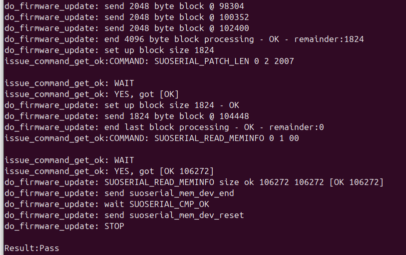
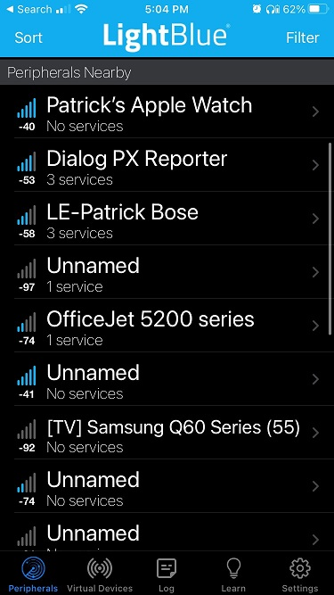
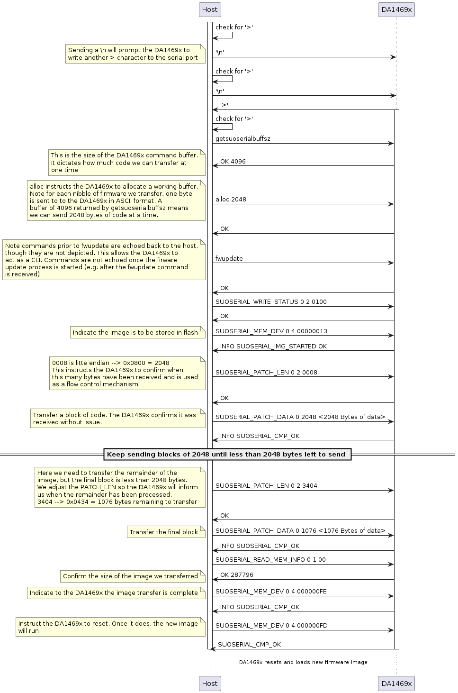

SUOSERIAL Demonstration Example{#suouart}
======================

This example demonstrates Software Update over UART as well as over USB, namely `SUOSERIAL`. The name convention is chosen since multiple peripherals can be used for the SW update. An executable, namely `host_suoserial`, is provided to run the example with a development kit connected to a PC which runs either Windows or Linux OS. The source code used to create this executable is provided in `host_suoserial.c`

## HW and SW Configuration

  - **Hardware Configuration**
    - This example runs on the DA1469x family of devices.
    - A [Pro Development Kit](https://www.renesas.com/us/en/products/wireless-connectivity/bluetooth-low-energy/da14695-00hqdevkt-p-smartbond-da14695-bluetooth-low-energy-52-development-kit-pro) (DevKit) is needed for this example.
  - **Software Configuration**
    - Download the latest [SDK](https://www.renesas.com/us/en/products/wireless-connectivity/bluetooth-low-energy/da14695-multi-core-bluetooth-52-soc-system-power-management-unit?gad_source=1) version for the target family of devices.

    - SEGGER J-Link tools are normally downloaded and installed as part of the [SmartSnippets Studio](https://www.renesas.com/us/en/software-tool/smartbond-development-tools) installation.

## How to run the example

### Initial Setup

- Download the source code from [GitHub](https://github.com/dialog-semiconductor/BLE_SDK10_examples). 

- Import the project into your workspace (there should be no path dependencies). If you are not familiar with these processes it's advised that you first familiarize yourself with the [Getting Started](https://lpccs-docs.renesas.com/um-b-090-da1469x_getting_started/Introduction/Introduction.html) guide.

- Connect the target device to your host PC via USB1. The mentioned port is used to power the device and to support serial and JTAG interfaces. These two interfaces can be used both for flashing and debugging purposes. If the application is built for USB, a second USB cable is required to connect the host with the USB connector on the Pro DevKit

- This example employs the `SUOTA` flash partition so that there is room for both the current and update firmwares. As such, it's imperative that the flash memory be erased before flashing the target application. This is imperative every time a new flash partition is loaded.

- Compile the source code (either in Release or Debug mode) and flash it into the chip. Dy default,`SUOUART_SUPPORT` is defined and so the application should be built for `SUOUART`. To switch to `SUOUSB`, one should comment out the `SUOUART_SUPPORT`declaration and uncomment the `SUOUSB_SUPPORT`declartion as illustrated at the beginning of  `custom_config_qspic`.

  ```
  /*
   * Default serial interfaces is UART. To switch to USB comment out the
   * SUPUART_SUPPORT macro definition and un-comment SUOUSB_SUPPORT.
   * Multiple firmware update interface definitions should throw build error.
   */
   #define SUOUART_SUPPORT
   //#define SUOUSB_SUPPORT
  ```

  Please note that the debug flavor should be used merely for debugging purposes since it increases the generated binary file, significantly. In addition, the source code is built to work with the embedded flash. Working with external flash memory devices is out of the scope of this demonstration example.  

- Once the application image is flashed, press the RESET button on the daughter board to start executing the application. 

- Open a command prompt at `<path_on_your_machine>/suoserial_sample_code/suoserial_host`. 

- If the host runs on a Windows machine hit `host_usb.exe <ACM port> pxp_reporter.1.0.0.1.img -verbose`.
  - Where `ACM port` is the USB CDC port created by the USB CDC class driver. 
  - `pxp_reporter.1.0.0.1.img` is a pre-compiled proximity reporter SDK sample code that integrates the SUOSERIAL service. That means that, once the FW update completes a new SW update over UART can take place.
  - Debug message can be enabled with the `-verbose` option.
  
- Optionally, open the SEGGER JLink RTT Viewer to get various debug messages. To do so, the `_SEGGER_RTT` symbol address should be retrieved from the generated `.map` file and be filled in the address field of the viewer as depicted below:  

  

  

  Please note that if the USB CDC interface is selected and no retarget operations (RTT) are needed, the SoC can be powered directly from the USB port. In that case, the daugherboard can be detached from the motherboard, completely (given that no other I/O pins are used).  

- If the verbose functionality is enabled various info should be displayed throughout the update process: 



- Once the update process is completed successfully, DA1469x will reset and start advertising the `pxp_reporter` application. 



### Command Flow Overview

The below sequence diagram provides of an overview of the commands/responses exchanged between the `host_suoserial` executable running on the PC and the DA1469x running the `suoserial` service. 

